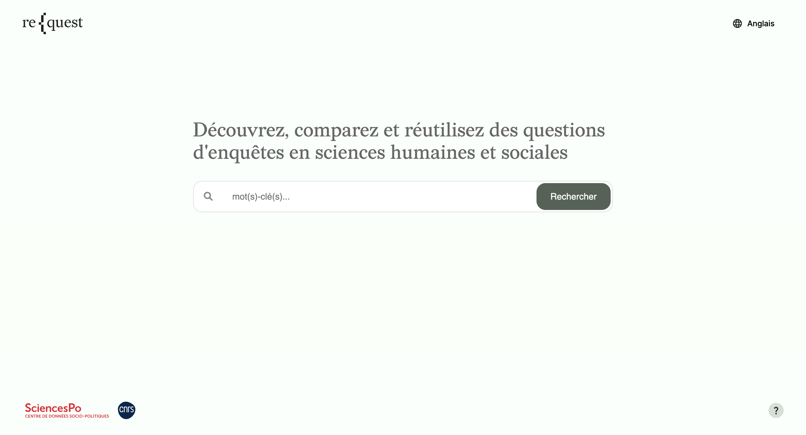
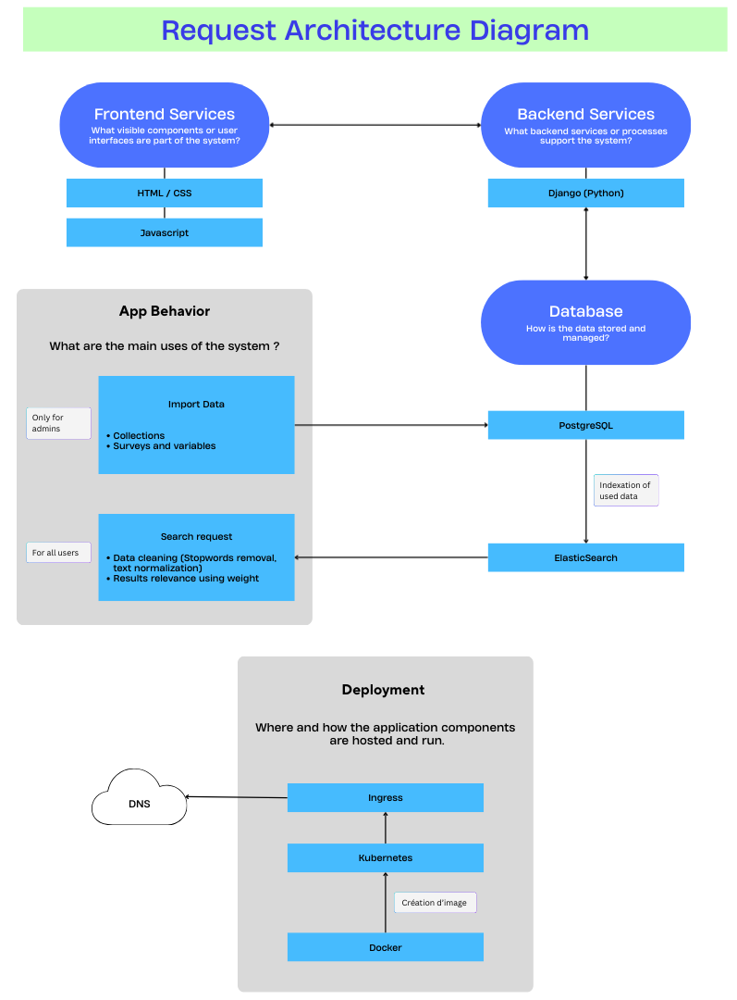

# request-ddi

|         |                                                                                                                                                                                                                                                                                                                                                                                                                 |
| ------- | --------------------------------------------------------------------------------------------------------------------------------------------------------------------------------------------------------------------------------------------------------------------------------------------------------------------------------------------------------------------------------------------------------------- |
| CI/CD   | [](https://github.com/CDSP-SCPO/request-ddi/actions/workflows/ci.yml?query=branch%3Amain)                                                               |
| App    |                                                                                                                                                                                                                              |
| Docs    | [](https://request.sciencespo.fr/docs/)                                                                                                                                                                                                                             |
| Package | [](https://github.com/CDSP-SCPO/request-ddi/releases/latest)                                                                                                                                                                    |
| Meta    | [](https://www.gnu.org/licenses/gpl-3.0) [](https://github.com/astral-sh/ruff) |

## Background

In the context of the increasing amount of research data available in the last years and 
the European and national efforts around the FAIR principles, 
this project aims to built a system to gather and harmonise Social Science and Humanities (SSH) surveys metadata 
from different sources to facilitate data reusability by the academic sphere and beyond.

## Description

re{quest – reuse questionnaire data – is an open-source web application designed by the
[Centre des Données Socio-Politiques (CDSP) - Sciences Po, CNRS](https://www.sciencespo.fr/cdsp/fr/).
It combines a PostgreSQL database for structured metadata storage with an Elasticsearch index for efficient full-text and similarity search. 
Together, they support the discovery, comparison, and reuse of social science survey metadata.
The database stores structured information on questionnaires, including question texts, response categories, 
and variable information mappings across studies and waves. 
Built on the ETL process, re{quest's pipeline uses standardised metadata schemas using the [Data Documentation International (DDI)](https://ddialliance.org/) norm.
To date, [request.sciencespo.fr](https://request.sciencespo.fr) provides an online access to a centralised, searchable and reusable database 
of 65,000 questions and variables across more than 250 quantitative surveys of the
[CDSP's Data Bank](https://data.sciencespo.fr/dataverse/cdsp)

## Contents

* [Application overview](#application-overview)
* [Architecture](#architecture)
* [Getting started](#getting-started)
    * [Prerequisites](#prerequisites)
    * [Installation](#installation)
    * [Running with Docker](#running-with-docker)
    * [Running with Podman](#running-with-podman)
* [Versioning](#versioning)
* [Changelog](#changelog)
* [License](#license)
* [Authors and contributors](#authors-and-contributors)
* [Acknowledgments](#acknowledgments)

## Application overview

[](https://request.sciencespo.fr)

User documentation can be found at [docs](https://request.sciencespo.fr/docs)

---

## Architecture

The application is built with the following components:

* **PostgreSQL** : Relational database for data storage.
* **Elasticsearch** : Search engine for indexing and advanced search capabilities
* **request-ddi app** : Main application developed in Django

For now we are using both PostgreSQL and Elasticsearch. We store all the data the app
requires using PostgreSQL, and then we are indexing the information we need using
Elasticsearch, therefore making the search faster and more precise.



## Getting Started

### Prerequisites

* Docker or Podman
* Docker Compose or Podman Compose
* Python 3.9+ (for local development without Docker)

### Installation

#### As a Standalone Application

Clone the repository:

```bash
git clone https://github.com/CDSP-SCPO/request-ddi.git
cd request-ddi
pip install .
```

#### As a Library/Dependency

The Request DDI application can be installed as a Python package and integrated into
other Django projects:

```bash
# Install directly from the repository
pip install git+https://github.com/CDSP-SCPO/request-ddi.git@main
```

To use Request DDI in your own Django project:

1. Add `request_ddi` to your `INSTALLED_APPS` in `settings.py`:

```python
INSTALLED_APPS = [
    # ... your other apps
    'request_ddi',
]
```

2. Include the Request DDI URLs in your project's `urls.py`:

```python
from django.urls import path, include

urlpatterns = [
    # ... your other urls
    path('request/', include('request_ddi.urls')),
]
```

This modular design allows Request DDI to be reused across different projects as a
dependency.

### Running with Docker

Simply execute:

```bash
docker compose up --build
```

After the build completes, access the local project at
[http://localhost:8000](http://localhost:8000)

To run in detached mode:

```bash
docker compose up --build -d
```

To stop the environment:

```bash
docker compose down
```

### Running with Podman

If rootful Podman is being used, `docker` in the above commands can be replaced with
`podman` to start the development environment.

```bash
podman compose up --build
```

In case rootless Podman is being used, it is necessary to set the container UID and GID
to `root` to be able to edit the files.

```bash
CONT_UID=0 CONT_GID=0 podman compose up --build
```

This does not impose any security issues as in the case of rootless Podman, the host
user is mapped to `root` user in the container.

## Running Tests

The project includes comprehensive unit tests that can be run in multiple ways.
A dedicated `test_settings.py` configuration uses SQLite for testing, allowing tests
to run with or without PostgreSQL and Elasticsearch.

### Running Tests Outside Docker

When Elasticsearch is **NOT** running, tests requiring the service
will be automatically skipped:

```bash
# Install test dependencies
pip install -e '.[test]'

# Run all tests with pytest
pytest
```

### Running Tests Inside Docker

The tests that require Elasticsearch can be run by spinning up local development
environment using Docker compose/Podman compose and running the tests inside the
docker container.

```bash
# Start dev environment and wait for all services to be online
docker-compose up --build

# Start a shell inside request-ddi container
docker exec -it request-ddi bash

# Run all tests with pytest
pytest
```

## Versioning

This project follows [Semantic Versioning](https://semver.org/) (SemVer):

* **MAJOR** version for incompatible API changes
* **MINOR** version for backwards-compatible functionality additions
* **PATCH** version for backwards-compatible bug fixes

## Changelog

See [CHANGELOG.md](CHANGELOG.md) for a detailed list of changes between versions.

## License

This project is licensed under GNU GPL v3 - see the [LICENSE](LICENSE) file for details.

## Authors and contributors

The list of authors and contributors is available in the [AUTHORS.md](AUTHORS.md) file.

## Acknowledgments

**re { quest** is developed by the [Centre for socio-political data (CDSP)](https://www.sciencespo.fr/cdsp/fr/),
a Support and Research Unit jointly operated by [Sciences Po](https://www.sciencespo.fr/en/)
and the [CNRS](https://www.cnrs.fr/en), and received the support of the French National Research Agency
([ANR-24-RESO-0003](https://anr.fr/Projet-ANR-24-RESO-0003))
