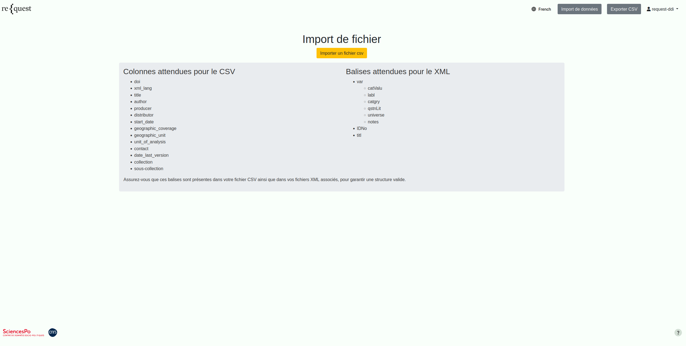
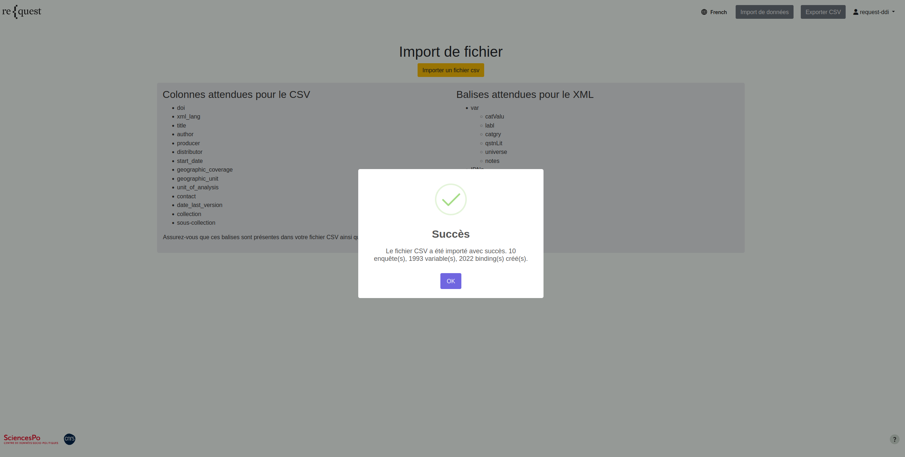

# Upload Survey Data into ReQuest

## Input file spec

Currently ReQuest app supports input data file in CSV format that must have following
columns:

- doi
- xml_lang
- collection
- sous-collection
- title
- author
- producer
- distributor
- start_date
- geographic_coverage
- geographic_unit
- unit_of_analysis
- contact
- date_last_version
- url

The significance of all columns except `url` can be found in this [document](https://docs.google.com/spreadsheets/d/e/2PACX-1vTqH1js1tPp9y15FZzrYSvUEIsqWHt-gITP9jfjSbI2ch-SJqMQ4zvPi-2B37JqD-wJb9aGul4UAsiW/pubhtml?gid=1610368963&single=true).
The column `url` must provide a **direct URL** to fetch the DDI-C XML file from the underlying
data cataloging software. Finding the URL of the XML file is data cataloging software
specific task.

For instance, for Dataverse, this URL can be easily fetched by visiting the following
page `https://<DATAVERSE_URL>/api/datasets/export?exporter=ddi&persistentId=<DOI>` where
`DATAVERSE_URL` is the base URL of Dataverse instance (_e.g._ `data.sciencespo.fr`) and
`DOI` must be a valid DOI (_e.g._ `doi:10.21410/7E4/AAZEFB`). This will present a DDI-C
XML file where the element `otherMat` will contain the URL for XML containing
variable level metadata.
For instance, by navigating to `https://data.sciencespo.fr/api/datasets/export?exporter=ddi&persistentId=doi%3A10.21410/7E4/AAZEFB` and inspecting `otherMat` elements, following XML file element can be found.

```xml
<otherMat ID="f9219" URI="https://data.sciencespo.fr/api/access/datafile/9219" level="datafile">
<labl>fr.cdsp.ddi.elipss.ea25.xml</labl>
<notes level="file" type="DATAVERSE:CONTENTTYPE" subject="Content/MIME Type">text/xml</notes>
</otherMat>
```

The URL in the attribute `URI` is the URL from where the XML file containing variable
level metadata can be fetched.

A sample CSV file can be found in the repository in [data](../data/) folder and it can
be used to import sample data into the application for developmental purposes.

## Importing survey data

Once the application is running in the local environment, sample data can be imported
by visiting [`http://localhost:8000/upload-csv-collection/`](http://localhost:8000/upload-csv-collection/).
This page will request the admin credentials and for the default Docker environment, the
username and password are `request-ddi` and `request-ddi-secret`. Once the user has been
successfully authenticated, following page will be rendered:



By clicking `Importer un fichier CSV` and choosing the [surveys.csv](../data/surveys.csv)
file provided in the repo, survey data can be imported into the application. At the
end of import process, a dialogue appears showing the stats of imported surveys as
shown below:



More details on each survey like number of variables, time taken to import each survey
can be found in the server logs:

```bash
[request-ddi]   | DEBUG 2026-03-16 10:27:18,238 data_importer ⏱ Temps d'import — Survey 'Baromètre nucléaire (2005)', DOI 'doi:10.21410/7E4/DDDHXW', 174 Variables : Total 3.56 s, Temps per question 0.02 s
[request-ddi]   | DEBUG 2026-03-16 10:27:19,757 data_importer ⏱ Temps d'import — Survey 'Le baromètre de suivi de l'environnement IFEN-OIP (2001)', DOI 'doi:10.21410/7E4/MFVUFA', 60 Variables : Total 1.40 s, Temps per question 0.02 s
[request-ddi]   | DEBUG 2026-03-16 10:27:21,906 data_importer ⏱ Temps d'import — Survey 'Enquête interrégionale des phénomènes politiques (2004)', DOI 'doi:10.21410/7E4/TIGPOW', 83 Variables : Total 2.03 s, Temps per question 0.02 s
[request-ddi]   | DEBUG 2026-03-16 10:27:30,298 data_importer ⏱ Temps d'import — Survey 'French Election Study 2022 - vague 5 (ELIPSS 2022)', DOI 'doi:10.21410/7E4/DJRAYB', 301 Variables : Total 8.10 s, Temps per question 0.03 s
[request-ddi]   | DEBUG 2026-03-16 10:27:37,430 data_importer ⏱ Temps d'import — Survey 'Image de la science (2011)', DOI 'doi:10.21410/7E4/GQQZAH', 188 Variables : Total 6.75 s, Temps per question 0.04 s
[request-ddi]   | DEBUG 2026-03-16 10:27:46,849 data_importer ⏱ Temps d'import — Survey 'Dynamiques de mobilisation - vague 9 (ELIPSS 2015)', DOI 'doi:10.21410/7E4/NNX14W', 271 Variables : Total 8.85 s, Temps per question 0.03 s
[request-ddi]   | DEBUG 2026-03-16 10:27:54,512 data_importer ⏱ Temps d'import — Survey 'Faire face au Covid-19 - vague 9 (ELIPSS 2022)', DOI 'doi:10.21410/7E4/2I4VC0', 295 Variables : Total 7.35 s, Temps per question 0.02 s
[request-ddi]   | DEBUG 2026-03-16 10:28:00,506 data_importer ⏱ Temps d'import — Survey 'Pratiques numériques - vague 9 (ELIPSS 2023)', DOI 'doi:10.21410/7E4/I5KTVF', 242 Variables : Total 5.65 s, Temps per question 0.02 s
[request-ddi]   | DEBUG 2026-03-16 10:28:06,251 data_importer ⏱ Temps d'import — Survey 'Enquête annuelle - vague 12 (ELIPSS 2025)', DOI 'doi:10.21410/7E4/AAZEFB', 196 Variables : Total 5.49 s, Temps per question 0.03 s
[request-ddi]   | DEBUG 2026-03-16 10:28:12,727 data_importer ⏱ Temps d'import — Survey 'Enquête annuelle - vague 9 (ELIPSS 2022)', DOI 'doi:10.21410/7E4/DG1NAC', 212 Variables : Total 6.00 s, Temps per question 0.03 s
[request-ddi]   | INFO 2026-03-16 10:28:12,796 timing ⏱ La fonction 'form_valid' a pris 58.314 secondes.
[request-ddi]   | DEBUG 2026-03-16 10:28:12,796 timer Endpoint: dispatch | Time: 58.3635s
[request-ddi]   | DEBUG 2026-03-16 10:28:12,796 logging URL: /upload-csv-collection/ | Total time: 58.3650s | Method: POST
[request-ddi]   | INFO 2026-03-16 10:28:12,801 log "POST /upload-csv-collection/?force_update=true HTTP/1.1" 200 246
```

Once the data has been successfully uploaded, the application is ready and metadata
can be searched by visiting [`http://localhost:8000/`](http://localhost:8000/).
